# 🌱 Mehrano Agri Farms: Smart IoT Irrigation & Monitoring System

## 📖 Project Overview
This repository contains a comprehensive, IoT-based smart irrigation and environmental monitoring system developed for Mehrano Agri Farms. Designed as a solution for modern agricultural challenges, this project tackles the critical issue of ineffective irrigation management caused by manual monitoring and fixed watering schedules. 

By integrating simulated edge devices, cloud analytics, and business intelligence, this project demonstrates a complete, end-to-end data value chain, transforming raw environmental metrics into automated actions and actionable insights.

## 🎯 Key Objectives
* **Automated Irrigation Control:** Activate water pumps dynamically based on real-time soil moisture thresholds to prevent water wastage and ensure consistent crop growth.
* **Real-Time Environmental Monitoring:** Continuously track soil moisture (%), temperature (°C), humidity (%), and wind speed (km/h).
* **Data Processing & Integration:** Create a seamless, low-latency pipeline from edge sensors to cloud storage using lightweight communication protocols.
* **Advanced Data Visualisation:** Provide clear, predictive insights through interactive dashboards to aid farm managers in long-term decision-making.

## 🛠️ Technology Stack
This project utilizes a hybrid IoT architecture, leveraging both edge and cloud processing layers:
* **Simulation & Hardware:** Cisco Packet Tracer (ESP8266 Microcontrollers, Environmental Sensors, IoT Gateway)
* **Communication Protocol:** MQTT for low-latency, lightweight data transmission
* **Middleware & Integration:** Node-RED for workflow automation, logic implementation, and real-time UI dashboarding
* **Cloud Platform:** ThingSpeak for data storage, MATLAB-based visualisations, and REST API endpoints
* **Business Intelligence:** Microsoft Power BI (integrated via Power Query) for historical trend analysis and KPI tracking

---

## 🔄 Development & Iteration Lifecycle
This system was built using a structured Software Development Life Cycle (SDLC). After the initial deployment, rigorous testing and stakeholder feedback drove three distinct phases of iterative improvement.

### 🚀 Initial Implementation (Iteration 0)
The foundation of the project focused on hardware simulation, establishing connectivity, and basic cloud integration.
* **Hardware & Network:** Configured ESP8266 microcontrollers and environmental sensors in Cisco Packet Tracer, utilizing a Farm Gateway and MQTT broker for transmission.
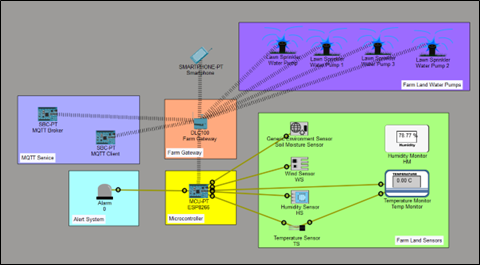
* **Cloud & Visualisation:** Created a ThingSpeak channel to receive MQTT data streams and established a REST API connection to Power BI for an initial, baseline dashboard.

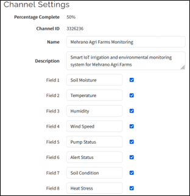
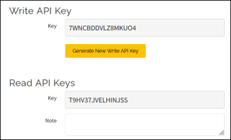
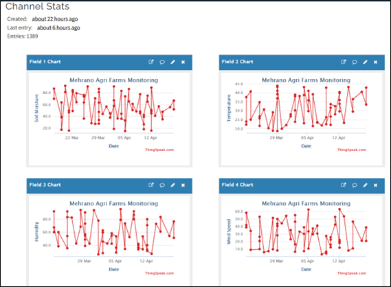
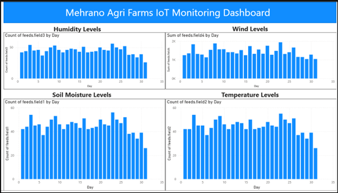

### 🧪 Testing & Stakeholder Feedback
Following the initial deployment, the system underwent functional, communication, and API testing. End-user feedback highlighted:
* **Usability:** Dashboards lacked vivid visuals and clear measurement units.
* **Data Quality:** Raw data required cleaning for accurate analysis.
* **Automation:** The system lacked a middleware layer for real-time processing and automated responses.

### 🛠️ Iteration 1: Data Processing and Cleaning
Focused on improving data accuracy and interpretation within the cloud platforms.
* **ThingSpeak:** Integrated MATLAB analytics to create detailed charts, including a lamp pump indicator and a wind speed gauge.
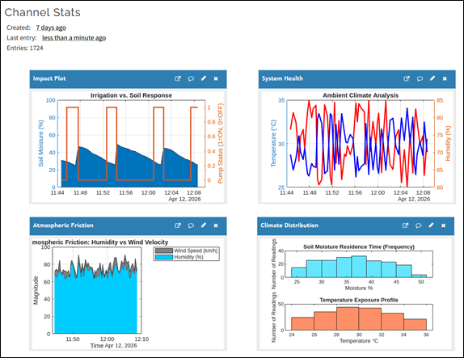
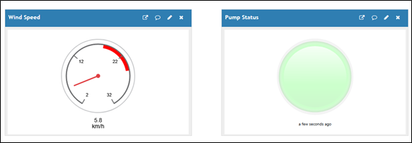

* **Power BI:** Applied Power Query transformations to clean and format the raw data, resulting in a much more organized and readable dashboard.
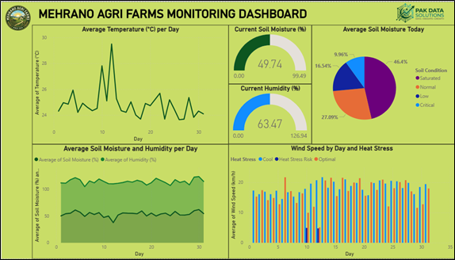

### ⚙️ Iteration 2: Integration Layer and Real-Time Workflow
Focused on solving the automation and real-time processing gaps identified by IT staff.

* **Node-RED Middleware:** Introduced a central processing layer to fetch MQTT data, apply threshold logic (e.g., triggering irrigation based on soil moisture), and upload formatted payloads to ThingSpeak.
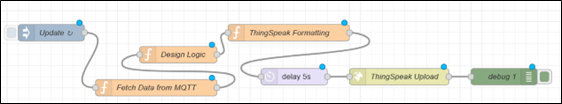

* **Live Dashboard:** Deployed a real-time monitoring UI directly within Node-RED for immediate environmental tracking.
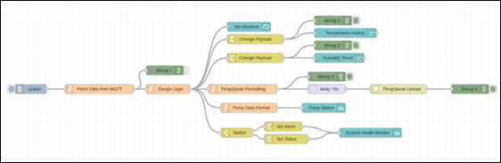
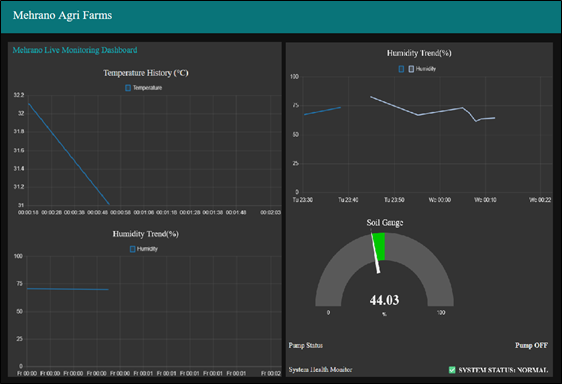

### 🎨 Iteration 3: Advanced Visualisation and User-Centric Optimisation
The final phase aimed at maximizing usability and providing professional-grade decision support.
* **Node-RED UI Overhaul:** Replaced basic dashboard nodes with advanced HTML/CSS template nodes, creating custom widgets like the Hydraulic Stress Engine and Atmospheric Friction indices.
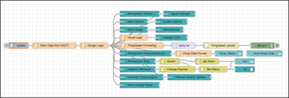
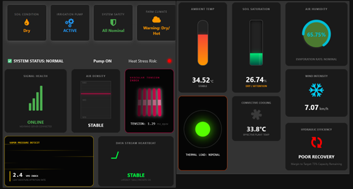

* **Power BI Enrichment:** Added complex KPIs, pie charts for soil condition distribution, and configured automated daily refresh schedules to ensure data relevancy.
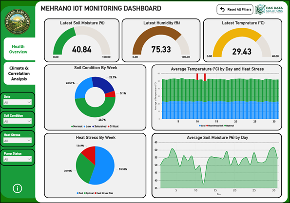
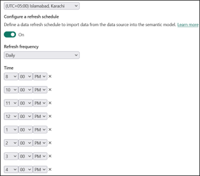

### [Link to the Dashboard](https://app.powerbi.com/view?r=eyJrIjoiMDlhOWM3N2EtMzY4Ny00YzMzLWE0YzctOWIzOTA2YzhlNWI1IiwidCI6IjQwODVlNDhhLTQxODItNDkzNS1hOWY1LTQyOTU0Mzc1NTQ3YyIsImMiOjl9)
---

## 📂 Repository Structure
```text
mehrano-agri-farms-iot/
├── docs/
│   ├── ThingSpeak Reference Document.docx
│   └── Unit20-AB1-Sahil Faraz (TG 36346).pdf
├── cisco-simulation/
│   └── Mehrano_IoT_Simulation.pkt
├── node-red/
│   ├── Node-RED Workflow.json
│   └── Power Query.json
├── power-bi/
│   ├── Iteration 0.pbix
│   ├── Iteration 2.pbix
│   └── Iteration 3.pbix
├── images/
│   ├── cisco_setup.png
│   ├── initial_power_bi.png
│   ├── matlab_charts.png
│   ├── nodered_workflow.png
│   ├── nodered_live_dashboard.png
│   ├── nodered_advanced_ui.png
│   └── final_power_bi.png
└── README.md
